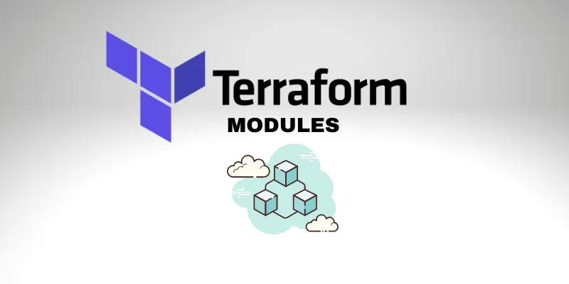
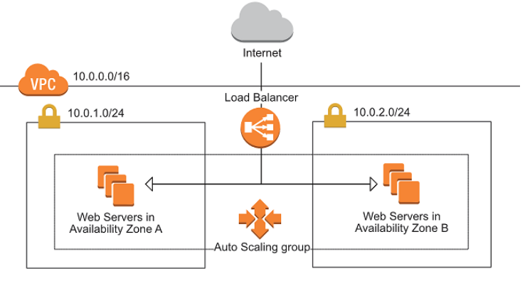

# IAAC 
## Description
- In here I tried to use modules to deploy a custom vpc , asg and alb in three subnets.
- it uses terraform modules.
- you can optionally deploy your resources in Dev or Qa environment.

## Usage
- deploys ec2 instances fronted by an ALB scaled by and ASG in a custom vpc.

## how to use?
- have aws account
- have git locally installed
- have terraform and AWS credential configured inside the terraform server
- after cloning the repo you can either go to qa or dev folder and run the terraform commands to deploy the resources.

```
git clone https://github.com/Saintmori/terraform_web_module.git
```
```
cd dev
or 
cd qa
terraform init
terraform plan
terraform apply
```
## contributors:
@saintmori
## License: